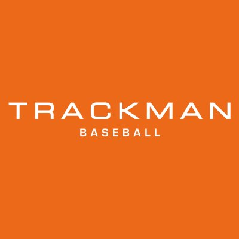

::: {.grid}

::: {.g-col-12 .g-col-md-4}
{style="border-radius: 15px; width: 100%; max-width: 400px;"}
:::

::: {.g-col-12 .g-col-md-8}
I am a Biology major and Data Science minor at **Lawrence University**, wrapping up my fourth year of collegiate baseball as a pitching captain. My mission is to bridge the gap between strength and conditioning and throwing rehabilitation, utilizing data analytics to push athlete abilities and assist pitchers throughout return-to-throw (RTT) processes. 
:::

:::

## Coaching & Development
As I transition into a full-time role as a High Performance Trainer at the **Kinetic Performance Institute (KPI)**, I work extensively with high school and college pitchers in the weight room and on the mound. By leveraging **R** and **Python**, I build models to optimize pitching strategies and develop RTT protocols that prioritize both high-velocity performance and long-term player health. I hope to make interesting, informative visualizations with clean, accurate data to help players better understand how they move and allow practitioners to program more efficently.

## Research & Biomechanics
My analytical approach relies heavily on biometric data collected from real athletes. I exclusively utilize **Hawkins** and **Newt** force plate data to look at changes over time, create injury management models, and organize hundreds of athletes' data. My recent senior capstone study, *"Bulletproofing the Elbow,"* investigated potent training modalities for UCL-related musculature. The study found a highly significant 0.91 effect size on grip strength for the Explosive-Impulse Group (EIG). To monitor and program for these adaptations, I integrated data from systems like **Armcare.com**, **Tindeq**, and **Trackman**. After submitting for publication to the *Topics of Exercise Science and Kinesiology*, I was invited onto the Layback Podcast with FlexProGrip founder Adam Moreau, where we go on a deep dive into impulses and my research. [Check that out here!](https://youtu.be/XVqAdkR39-M?si=frglf8vRVRyMY62l)

---

### Affiliations & Technologies

::: {layout-ncol=3}
{width=200, height=200}

{width=200, height=200}

{width=200, height=200}
:::