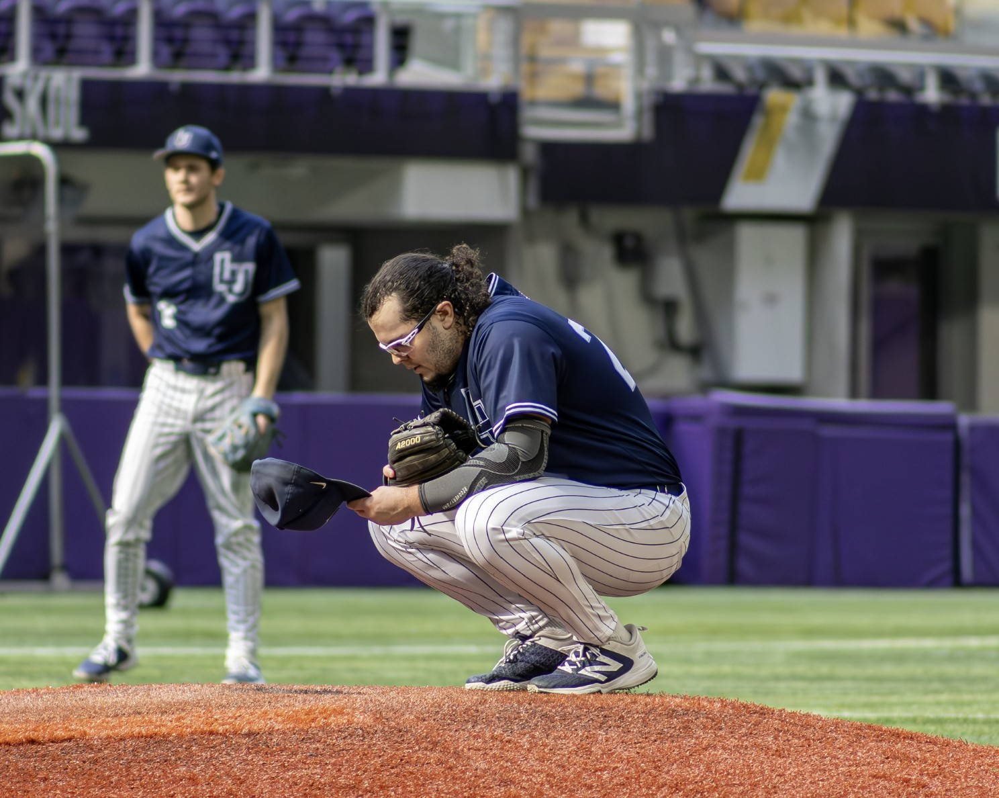

I am a Biology major and Data Science minor at **Lawrence University**. As I am finishing up my fourth year of collegiate baseball, I hope to apply my expertise and experience to other athletes. My mission is to bridge the gap between strength and conditioning and throwing rehabilitation, utilizing data analytics to push our understanding of the throw. I'm currently working as a high performance trainer at Kinetic Performance Institute, working with high school and college pitchers in the weight room and on the mound.

By leveraging ***R***, ***Python***, and ***biometric data***, I specialize in optimizing pitching strategies and developing **Return-To-Throw** protocols that prioritize both high-velocity performance and long-term player health. My research uses systems like **Armcare.com**, **driveline PUlSE**, and **FlexProGrip** to target the musclatrure closely related to the UCL, looking to find potent training modalities to use in return-to-throw programming.

::: {layout-ncol=3}
{width=200, height=200}

{width=200, height=200}

{width=200, height=200}

:::