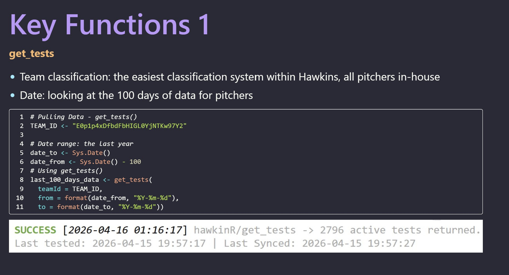
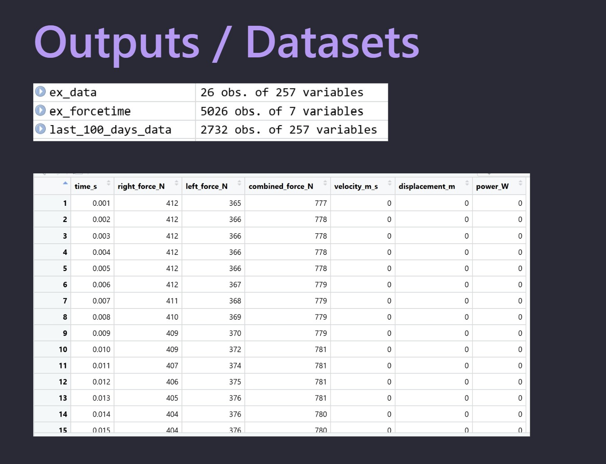

## Project 1: R Package Presentation
* [**HawkinR Presentation**](http://rpubs.com/nickkatz625/1422700)

This presentation created in Quarto outlines the usage of the hawkinR package, an API integration package made for force plate data acquisition. It goes over how to set up the API
connection, pull different types of data, and store force plate data from over 400 athletes.

{width="100%"}

{width="100%"}