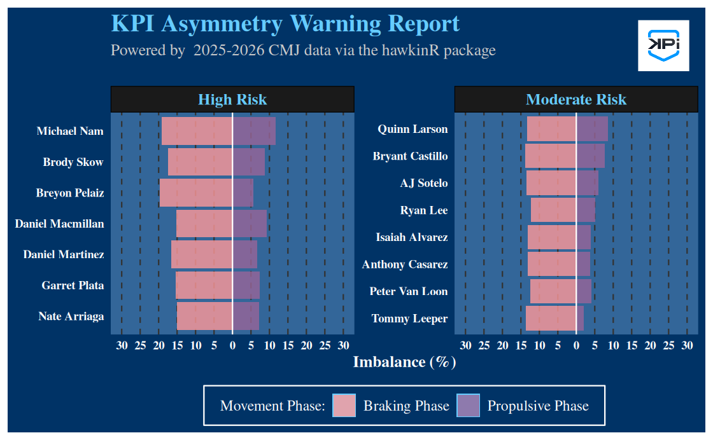
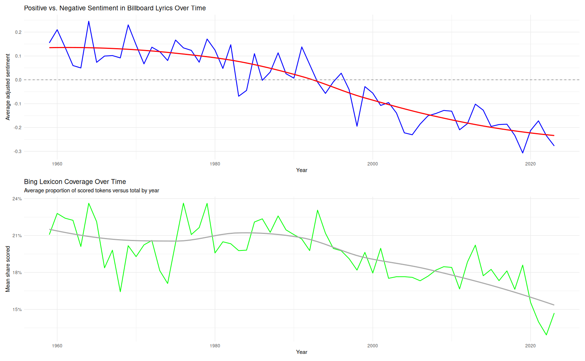
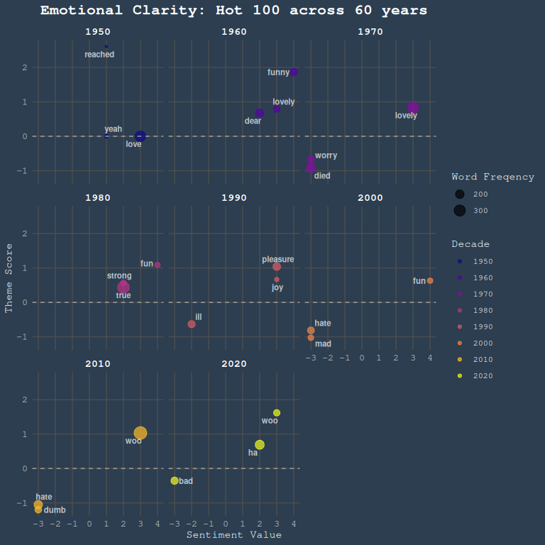

## Project 1: R Package Presentation
* [**HawkinR Presentation Code**](http://rpubs.com/nickkatz625/1425460)

This presentation created in Quarto outlines the usage of the hawkinR package, an API integration package made for force plate data acquisition. It goes over how to set up the API
connection, pull different types of data, and store force plate data from over 400 athletes.

{width="100%"}

{width="100%"}

## Project 2: SQL Database creation
* [**SQL Workflow Code**](https://github.com/nickkatz625/SQL-HawkinsR-Database)

This project showcases the end-to-end data engineering workflow of building, optimizing, and querying a local relational database for sports performance tracking. Using raw force plate data spanning 365 days of testing across more than 400 athletes, this project involved extracting metrics from Countermovement Jumps (CMJ), Squat Jumps (SJ), and Multi-Rebound (MR) tests. 

 **Project Workflow & Architecture**
 
* **Data Extraction & Cleaning:** Handled severe data density by cutting down original datasets containing 257 variables to jump-specific metrics (ranging between 34 to 87 optimized variables) using `tidyverse`.
* **Database Engineering:** Initialized an embedded high-performance **DuckDB** database instance directly in R. Designed relational schemas to handle specialized tracking, creating standalone optimized tables for `athletes`, `CMJ_cleaned`, `SJ_cleaned`, and `MR_cleaned` with designated Primary Keys and strictly defined data types.
* **Advanced SQL Querying:** Formulated complex analytics queries to track performance trends, utilizing:
    * `UNION` operations to isolate the fastest explosive movers across multiple jump tests based on takeoff velocities.
    * Multiple `LEFT JOIN` operations and aggregate metrics (`AVG`, `HAVING COUNT(*)`) to evaluate relationships between landing mechanics and reactive strength indices.
    * Conditional programming using `CASE WHEN` clauses to engineer automated data-driven alerts flag ranking athletes at **Balanced**, **Moderate Risk**, or **High Risk** based on bilateral force imbalances.
* **Biomechanical Visualization:** Programmed a high-impact, custom-themed asymmetric population plot using `ggplot2`, `patchwork`, and `magick` to visually split and isolate left-vs-right limb deficiencies across movement phases (Braking vs. Propulsive) for risk management.

{width="100%"}

## Project 3: Text Analysis Blog with Hot 100 Lyrics
* [**Textual Analysis Code**](https://github.com/nickkatz625/Textual-Analysis)

This project leverages computational text mining, regular expressions, and sentiment lexicons in **R** to analyze how the emotional valence and core themes of popular music have shifted across more than six decades of American culture in a blogpost. Using a dataset of Billboard Hot 100 song lyrics spanning 1959 to 2023, this analysis tests the common cultural sentiment that modern media has grown progressively "bleaker" over time. Working with a classmate, we completed a variety of analyses to explore this.

**Technical Workflow & Methodology**

* **Advanced Text Cleaning:** Built robust regular expressions via `stringr` to eliminate data density obstacles and scraping artifacts. Programmed custom extraction patterns to strip metadata prefixes, structural identifiers (e.g., `[Chorus]`, `[Verse]`), standalone musical notes (`♫`), and chart-position labels without mutating actual lyrical strings.
* **Tokenization & Corpus Pruning:** Utilized `tidytext` to tokenize millions of rows of text down to individual word tokens, filtering out standard English stop words as well as multi-lexicon profanity and hate speech filters from the `lexicon` package to avoid rare-token confounding.
* **Sentiment Analysis & Lexicon Evaluation:** Linked token data across multiple emotional databases:
    * Used the **Bing lexicon** to calculate a normalized, length-adjusted sentiment score. The data reveals a clear negative trend line starting in the mid-1990s, while concurrently mapping a 30% relative decline in lexicon coverage caused by systemic shifts toward African American Vernacular English (AAVE) in chart-topping hip-hop.
    * Integrated the **AFINN lexicon** to map granular emotional valence against specific decades.
* **Theme Extraction via tf-idf:** Applied Term Frequency-Inverse Document Frequency (`bind_tf_idf`) grouped by decade to discover signature words defining different generations of listeners. By creating a custom scaled interaction index ($\text{tf-idf} \times \text{AFINN Valence}$), the project isolates heavily weighted, high-emotion terms to explicitly trace historical turning points—such as the bleakness of the 1970s and a surprise rebound toward highly positive vernacular ("woo", "ha") in the early 2020s.

{width="100%"}
{width="100%"}

## Project 4: Package Creation

