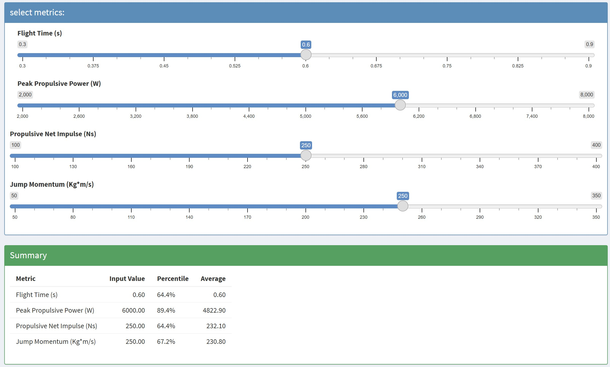
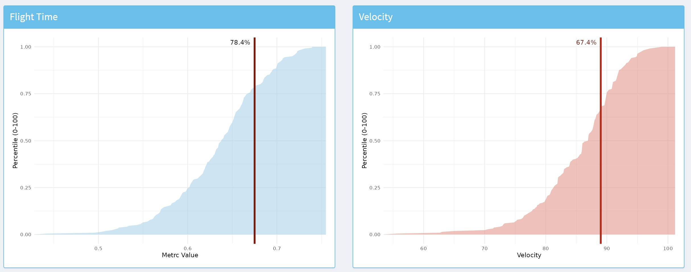

## Project Overview
Looking for an innovative project to finish up CMSC 205, I chose to build a shiny app based on force plate data from the last 6 months at Kinetic Performance Institute. The data used was from 80 pitchers in house, containing their highest jump numbers by jump height and maximum velocity on the mound. My goal was to create a basic dashboard to analyze key jump metrics in relation to our pitchers. The counter-movement (CMJ) and squat jump (SJ) are the two most common tests we use, with all athletes jumping weekly during training. Within these jump tests, a few key metrics stand out for understanding strengths and weaknesses within high-speed, coordinated movements like the throw. For example, both UIs contain peak propulsive power and propulsive net impulse. These two metrics relate to the acceleratory phase of the jump, where the athlete must produce force from a lengthened position to get off the ground. This phase relates strongly to the throw, as the ability to transmit force into our lead leg and subsequently the torso, arm, and ball is essential in strength training goals. This app was my first project with shiny, and I hope to expand on the dashboard with more extensive data in the future.
{.column-body-outset}
      

{width="100%"}
    

## Features
* **ECDF Percentiles:** percentiles calculated with empirical cumulative distribution functions, allowing for within-group analysis
* **Customizable inputs:** Built using `tidyverse` and `Shiny`, key metrics testing data allows for personal input and selection

## View the Project
* [**Live Shiny App**](https://gpr3vz-nick-katz.shinyapps.io/fpapp/) 
* [**View Source Code on GitHub**](https://github.com/nickkatz625/force-plate-percentile)